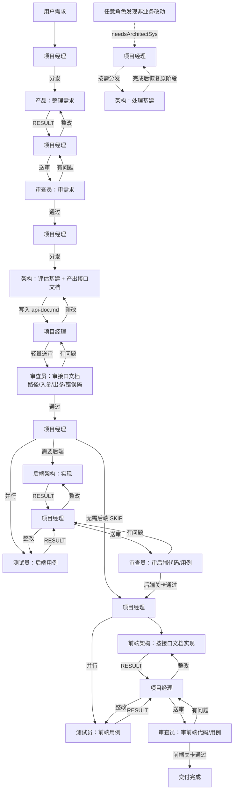

# FE-Agent 前端智能体

> 多角色协作的全栈开发 AI 助手

FE-Agent 通过模拟真实研发协作流程，自动化完成需求整理、架构评估、接口契约、后端、前端与测试审查。

## 核心特性

- **7 个 AI 角色协作**：项目经理、产品、架构、后端架构、前端架构、测试员、审查员
- **后端优先**：先出接口文档并轻量审查，再写后端，最后写前端
- **架构角色**：处理非业务基建改动，并产出接口文档
- **项目感知**：按项目结构与 skills 开发，优先复用已有模块/组件
- **知识库积累**：按角色落盘日志与知识
- **分级问题处理**：低/中/高，高级交用户决策

## 角色说明

| 角色 | 职责 |
|------|------|
| **项目经理** | 统筹分发，问题分级，协调审查与关卡推进 |
| **产品** | 整理需求（含后端能力与数据实体） |
| **架构** | 非业务改动；产出接口文档；开发前评估 + 过程中按需介入 |
| **后端架构** | 按接口文档实现后端，生成 backend skills |
| **前端架构** | 按接口文档 + 需求实现前端 |
| **测试员** | 先后端用例，再前端用例 |
| **审查员** | 审需求；轻量审接口文档；审后端/前端代码与测试 |

## 安装

```bash
npm install -g fe-agent
# 或
npx fe-agent start -r "你的需求描述"
```

从源码：

```bash
git clone <repo>
cd fe-agent
npm install
npm run build
npm link
```

## 使用

### 初始化

```bash
fe-agent init
```

或手动配置 `.env`：

```env
LLM_API_KEY=your-api-key
LLM_BASE_URL=https://api.openai.com/v1
LLM_MODEL=gpt-4o
```

### 启动

```bash
fe-agent start
fe-agent start -r "开发用户登录：含登录接口与登录页"
fe-agent start -f requirements.md
fe-agent start -u https://example.com/requirements
```

### 日志 / 知识库 / 状态

```bash
fe-agent logs
fe-agent logs -r backend
fe-agent logs -r architect_sys
fe-agent knowledge
fe-agent knowledge -r architect
fe-agent status
```

## 工作流程

整体由**项目经理**串起：接收各方结果 → 决定下一跳 → 有问题则整改回路，通过则进入下一关卡。



**执行顺序要点：**

1. 消息驱动：角色之间不直接调用，一律经项目经理分发。
2. 关卡制：接口文档过审后才进后端；后端 code + 后端测试都过审后才进前端。
3. 并行任务：同一关卡内「开发」与「写用例」由经理一并分发（编排器按消息顺序执行）。
4. 捷径：架构标注无需后端时，跳过后端关卡直达前端。
5. 旁路：过程中的基建/目录/依赖等非业务改动，随时转给架构，处理完再回到原阶段。
6. 高级问题：审查或提问为「高」时打断，询问用户后再继续。

## 项目结构（运行时）

```
.fe-agent/
├── logs/            # 按角色日志（含 architect_sys / backend）
├── knowledge/       # 按角色知识库
├── skills/
│   ├── architect.md
│   ├── backend.md
│   └── architect_sys.md
└── artifacts/
    └── api-doc.md   # 当前任务接口文档
```

## 配置

| 变量 | 说明 | 默认值 |
|------|------|--------|
| `LLM_API_KEY` | LLM API 密钥 | 必填 |
| `LLM_BASE_URL` | LLM API 地址 | `https://api.openai.com/v1` |
| `LLM_MODEL` | 模型名称 | `gpt-4o` |
| `LLM_TEMPERATURE` | 温度 | `0.7` |
| `LLM_MAX_TOKENS` | 最大 token | `4096` |

`fe-agent.config.json`：

```json
{
  "project": {
    "name": "my-project",
    "framework": "react",
    "language": "typescript"
  }
}
```

## 开发

```bash
npm install
npm run dev start -r "需求"
npm run build
npm start
```

## License

MIT
